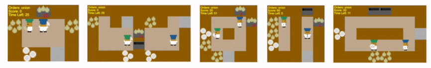

Project 3 readme

This is repository for project3 CS7642 2023 Fall

In this project, I implemented the reinforcement learning based algorithm for the OVERCOOKED-AI task.


## Dependencies
+ python==3.9.16
+ ipykernel==6.25.2
+ ipython==8.15.0
+ jupyter_core==4.12.0
+ matplotlib==3.6.2
+ numpy==1.23.5
+ pandas==2.1.1
+ torch==1.13.1
+ imageio==2.31.5
+ gym==0.26.2
+ overcooked_ai_py


## Introduction
The DQN related class are in OvercookedStudentNotebook_DQN.ipynb and DQN_classes.py.

The MADDPG related class are in overcooked_tutorial.ipynb and overcooked_maddpg.py,including MADDPG, prioritized buffer replay, and reward shaping.

## Training
All codes are in lunarLander_yshang42.ipynb, which include 3 classes in lunarLander_classes.py (extracted from lunarLander_yshang42.ipynb):\


## Run without training
If you want to replicated the results in the report, you could run without training. The program will just load the training logs, and checkpoints, and generate the figures in the report.


When testing the codes, I was using python 3.9.16 using Visual Studio Code. Other packages were in the requirements.txt

You may need to install required packages:
```
$ pip3 install pip --upgrade
$ pip3 install -r requirements.txt
```

To run lunarLander_yshang42.ipynb, you need to open it in Juperter notebook, and run the codes cell by cell.

Alternatively, you could run the exported python scripts
```
python lunarLander_yshang42.py
```
## Run with train